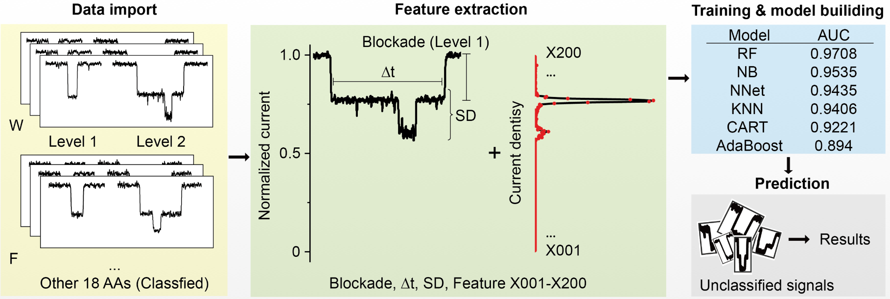
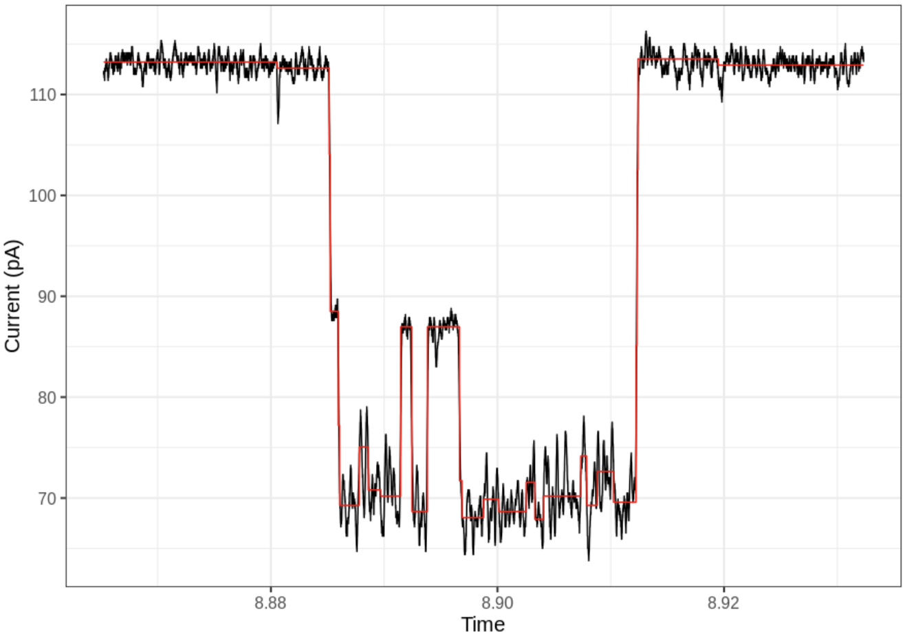

AANanopore
======

### 

### Content

- [Description](#Description)
- [Requirments](#Requirments)
  - [Data Requirements](#Data\ Requirements)
  - [Hardware Requirements](#Hardware Requirements)
  - [Software Requirements](#Software Requirements)
- [Installation](#Installation)
- [Examples](#Examples)
  - [Step1: Read and polish the raw current signal](#Step1: Read and polish the raw current signal)
  - [Step2 (optional): Identify the base line (L0) and blockade signal (L1) of amino acids signals](#Step2 (optional): Identify the base line (L0) and blockade signal (L1) of amino acids signals)
  - [Step3: Extract signal events from original signals](#Step3: Extract signal events from original signals)
  - [Step4: Extract features od signal events for classifier training or amino acid prediction](#Step4: Extract features od signal events for classifier training or amino acid prediction)
  - [Step5: Predict amino acid](#Step5: Predict amino acid)
- [License](#License)
- [References](#References)

### Description

[AANanopore](https://github.com/LuChenLab/AANanoporeR.git) is an open source R package for the signal processing, feature extraction, and prediction of amino acids nanopore signals. The original input file is .ABF file containing the current value of amino acids nanopore signals collected by Clampex software. In this package, the functions `CurrentPolish`, `LevelIdentify`, `SignalExtract`, `FeatureExtract`, and `Predict` can be used to process and predict the signals.

### Requirments

##### Data Requirements

If you want to run this R package successfully, you may need a ABF file and a classification model. Because the raw ABF file is too large for GitHub, we uploaded one of raw ABF file `21306010.abf` to [figshare](https://figshare.com/account/home). User can download the  `21306010.abf` file from  [figshare](https://figshare.com/account/home) by  [10.6084/m9.figshare.21385695](https://doi.org/10.6084/m9.figshare.21385695). For this manul, we also uploaded a trained random forest classifier to [figshare](https://figshare.com/account/home). User can also download the  `RF_model.Rds` file from  [figshare](https://figshare.com/account/home) by  [10.6084/m9.figshare.21385722](https://doi.org/10.6084/m9.figshare.21385722).

##### Hardware Requirements

The `AANanopore` package requires only a standard computer with enough RAM to support the operations defined by a user. For minimal performance, this will be a computer with about 2 GB of RAM. For optimal performance, we recommend a computer with the following specs:

- RAM: 16+ GB
- CPU: 4+ cores, 3.3+ GHz/core

##### Software Requirements

The package development version is tested on *Linux* operating systems. Before setting up the `AANanopore` package, users should have `R` version 4.0.0 or higher, and several packages set up from CRAN.

Users should install the following packages prior to installing `AANanopore`, from an `R` terminal:

```R
install.packages(c("changepoint", "readABF", "testthat", "S4Vectors", "IRanges", "plotly", "ggplot2", "data.table", "crosstalk"))
```

### Installation  

First, we need to install `devtools`:  

```R
install.packages("devtools")
library(devtools)
```

Then we just call  

```R
install_github("LuChenLab/AANanoporeR")
library(AANanopore)
```

### Examples

##### Step1: Read and polish the raw current signal

First, we need to read and polish the raw current signal from the ABF file using `CurrentPolish` function:

```R
library(AANanopore)
library(data.table)
library(ggplot2)
File <- file.path("/File/Path/To/ABF/File")
abf <- CurrentPolish(file = File, TimeStart = 0, TimeEnd = 0)
```

##### Step2 (optional): Identify the base line (L0) and blockade signal (L1) of amino acids signals

If the range of L0 (base line) and L1 (blockade signal) of ABF file is unknown, the function `LevelIdentify` can be used to identify:

```R
L01 <- LevelIdentify(object = abf, L0Min = NA, L0Max = NA, L1Min = NA, L1Max = NA)
```

##### 

##### Step3: Extract signal events from original signals

After identify the signal level of ABF file, we can use `SignalExtract` function to extract the signal events:

```R
BUBs <- SignalExtract(object = abf, L0Min = L01$L0Min, L0Max = L01$L0Max, L1Min = L01$L1Min, L1Max = L01$L1Max)
```

Here, the object `BUBs` is a R list with signal events. Extracted signal can be illustrate by function `SigPlot`, the read line indicating the polished value of current signal.

```R
SigPlot(x = BUBs[[1]])
```




##### Step4: Extract features od signal events for classifier training or amino acid prediction

Then, we can used function `FeatureExtract` to extract the features of each signal event for machine learning.

```R
Feats <- lapply(X = BUBs, function(x) FeatureExtract(x))
Feats[[1]]
# X001   X002   X003   X004   X005   X006   X007   X008   X009   X010   X011   X012   X013 
# 0.000  0.000  0.000  0.000  0.000  0.000  0.000  0.000  0.000  0.000  0.000  0.000  0.000 
# X014   X015   X016   X017   X018   X019   X020   X021   X022   X023   X024   X025   X026 
# 0.000  0.000  0.000  0.000  0.000  0.000  0.000  0.000  0.000  0.000  0.000  0.000  0.000 
# X027   X028   X029   X030   X031   X032   X033   X034   X035   X036   X037   X038   X039 
# 0.000  0.000  0.000  0.000  0.000  0.000  0.000  0.000  0.000  0.000  0.000  0.000  0.000 
# X040   X041   X042   X043   X044   X045   X046   X047   X048   X049   X050   X051   X052 
# 0.000  0.000  0.000  0.000  0.000  0.000  0.000  0.000  0.000  0.000  0.000  0.000  0.000 
# X053   X054   X055   X056   X057   X058   X059   X060   X061   X062   X063   X064   X065 
# 0.000  0.000  0.000  0.000  0.000  0.000  0.000  0.000  0.000  0.000  0.000  0.000  0.000 
# X066   X067   X068   X069   X070   X071   X072   X073   X074   X075   X076   X077   X078 
# 0.000  0.000  0.000  0.000  0.000  0.000  0.000  0.000  0.000  0.000  0.000  0.000  0.000 
# X079   X080   X081   X082   X083   X084   X085   X086   X087   X088   X089   X090   X091 
# 0.000  0.000  0.000  0.000  0.000  0.000  0.000  0.000  0.000  0.000  0.000  0.000  0.000 
# X092   X093   X094   X095   X096   X097   X098   X099   X100   X101   X102   X103   X104 
# 0.000  0.000  0.000  0.000  0.000  0.000  0.000  0.000  0.000  0.000  0.000  0.000  0.000 
# X105   X106   X107   X108   X109   X110   X111   X112   X113   X114   X115   X116   X117 
# 0.000  0.000  0.000  0.000  0.000  0.004  0.027  0.126  0.391  0.903  1.631  2.552  3.795 
# X118   X119   X120   X121   X122   X123   X124   X125   X126   X127   X128   X129   X130 
# 5.592  8.136 10.919 12.971 14.019 14.458 14.278 13.147 11.238  9.360  7.914  6.689  5.488 
# X131   X132   X133   X134   X135   X136   X137   X138   X139   X140   X141   X142   X143 
# 4.428  3.657  3.126  2.664  2.203  1.767  1.398  1.085  0.794  0.536  0.352  0.260  0.229 
# X144   X145   X146   X147   X148   X149   X150   X151   X152   X153   X154   X155   X156 
# 0.228  0.252  0.324  0.444  0.569  0.691  0.916  1.445  2.448  3.871  5.230  5.694  4.759 
# X157   X158   X159   X160   X161   X162   X163   X164   X165   X166   X167   X168   X169 
# 3.063  1.553  0.655  0.248  0.116  0.086  0.079  0.063  0.049  0.046  0.045  0.042  0.040 
# X170   X171   X172   X173   X174   X175   X176   X177   X178   X179   X180   X181   X182 
# 0.038  0.031  0.019  0.008  0.002  0.000  0.000  0.000  0.000  0.000  0.000  0.000  0.000 
# X183   X184   X185   X186   X187   X188   X189   X190   X191   X192   X193   X194   X195 
# 0.000  0.000  0.000  0.000  0.000  0.000  0.000  0.000  0.000  0.000  0.000  0.000  0.000 
# X196   X197   X198   X199   X200 
# 0.000  0.000  0.000  0.000  0.000 
# attr(,"AllTime")
# [1] 27.07
# attr(,"DwellTime")
# [1] 17.66
# attr(,"SignalSD")
# [1] 0.04052126
# attr(,"Blockade")
# [1] 0.378391
```

##### Step5: Predict amino acid

The signal event features of known amino acids can be used to train classifier or used to predict the amino acid type of new signal event. Here, we used our pre-trained random forest classifier to predict the `Fi`.

```R
# Load the pre-trained random forest classifier 
model <- readRDS("/Path/to/RF_model.Rds")
model
# Random Forest 
# 
# 81220 samples
# 204 predictor
# 20 classes: 'A', 'C', 'D', 'E', 'F', 'G', 'H', 'I', 'K', 'L', 'M', 'N', 'P', 'Q', 'R', 'S', 'T', 'V', 'W', 'Y' 
# 
# Pre-processing: centered (54), scaled (54), Yeo-Johnson transformation (54), remove (150) 
# Resampling: Cross-Validated (10 fold, repeated 10 times) 
# Summary of sample sizes: 73099, 73100, 73098, 73099, 73098, 73099, ... 
# Resampling results:
#   
#   Accuracy   Kappa    
# 0.8923492  0.8866833
# 
# Tuning parameter 'mtry' was held constant at a value of 60

Preds <- lapply(Feats, function(x) AANanopore::Predict(x = x, model = model))
Preds <- as.data.table(do.call(rbind, Preds))
Preds[1, ]
#    A     C D E F G H I     K L M N P     Q R S T V    W Y
# 1: 0 0.024 0 0 0 0 0 0 0.002 0 0 0 0 0.004 0 0 0 0 0.97 0
```

The result indicating that according our random forest classifier this signal event is W, and the probability is 0.97. 

```R
ggplot(melt.data.table(Preds), aes(x = variable, y = value)) + 
  geom_boxplot(outlier.color = NA) + 
  labs(x = "Amino acid", y = "Prediction probability") + 
  theme_bw(base_size = 15)
```


```R
Ans <- data.table(Prob = apply(Preds, 1, max), AA = colnames(Preds)[apply(Preds, 1, which.max)])
Ans[, .N, AA][order(N, decreasing = T)]
#     AA   N
# 1:   W 870
# 2:   C 201
# 3:   F  79
# 4:   G  37
# 5:   Y  23
# 6:   D  16
# 7:   Q  12
# 8:   I  11
# 9:   R  10
# 10:  E  10
# 11:  V   9
# 12:  N   9
# 13:  S   9
# 14:  H   8
# 15:  P   7
# 16:  A   6
# 17:  L   6
# 18:  K   5
# 19:  M   3
Ans[Prob > 0.7, .N, AA][order(N, decreasing = T)]
#    AA   N
# 1:  W 709
# 2:  C  24
# 3:  F   6
# 4:  E   1
# 5:  I   1
# 6:  Y   1
# 7:  G   1
# 8:  H   1
```

This results indicating that most of signal event are predicted as W.

##### Supplementary

The random forest classifier was trained using R package `caret`. And we used K-fold cross-validation to prevent overfitting of the modeling.

```R
library(caret)
library(doParallel)
fitControl <- trainControl(method = "repeatedcv",
                           number = 10,
                           repeats = 10)

cl <- makePSOCKcluster(10)
registerDoParallel(cl)
model <- train(Class ~ ., 
               data = Train, 
               preProc = c("center", "scale", "YeoJohnson", "nzv"),
               method = "rf", 
               trControl = fitControl,
               verbose = FALSE,
               ## to evaluate:
               tuneGrid = expand.grid(mtry = 60),
               # tuneLength = 50,
               metric = "Accuracy", 
               allowParallel = TRUE)
```


```R
sessionInfo()
# R version 4.0.2 (2020-06-22)
# Platform: x86_64-pc-linux-gnu (64-bit)
# Running under: Ubuntu 18.04.5 LTS
# 
# Matrix products: default
# BLAS:   /usr/lib/x86_64-linux-gnu/openblas/libblas.so.3
# LAPACK: /usr/lib/x86_64-linux-gnu/libopenblasp-r0.2.20.so
# 
# locale:
#   [1] LC_CTYPE=en_US.UTF-8       LC_NUMERIC=C               LC_TIME=en_US.UTF-8       
# [4] LC_COLLATE=en_US.UTF-8     LC_MONETARY=en_US.UTF-8    LC_MESSAGES=en_US.UTF-8   
# [7] LC_PAPER=en_US.UTF-8       LC_NAME=C                  LC_ADDRESS=C              
# [10] LC_TELEPHONE=C             LC_MEASUREMENT=en_US.UTF-8 LC_IDENTIFICATION=C       
# 
# attached base packages:
#   [1] stats     graphics  grDevices utils     datasets  methods   base     
# 
# other attached packages:
#   [1] ggplot2_3.3.2     data.table_1.13.0 AANanopore_0.1.0 
# 
# loaded via a namespace (and not attached):
#   [1] httr_1.4.2           tidyr_1.1.1          splines_4.0.2        jsonlite_1.7.1      
# [5] viridisLite_0.3.0    foreach_1.5.0        prodlim_2019.11.13   shiny_1.5.0         
# [9] stats4_4.0.2         yaml_2.2.1           ipred_0.9-9          pillar_1.4.6        
# [13] lattice_0.20-41      glue_1.4.1           pROC_1.16.2          digest_0.6.25       
# [17] XVector_0.28.0       RColorBrewer_1.1-2   promises_1.1.1       randomForest_4.6-14 
# [21] colorspace_1.4-1     recipes_0.1.13       cowplot_1.0.0        htmltools_0.5.0     
# [25] httpuv_1.5.4         Matrix_1.5-1         plyr_1.8.6           timeDate_3043.102   
# [29] pkgconfig_2.0.3      caret_6.0-86         zlibbioc_1.34.0      purrr_0.3.4         
# [33] xtable_1.8-4         scales_1.1.1         openxlsx_4.1.5       later_1.1.0.1       
# [37] gower_0.2.2          lava_1.6.7           readABF_1.0.2        tibble_3.0.3        
# [41] generics_0.0.2       farver_2.0.3         IRanges_2.22.2       ellipsis_0.3.1      
# [45] withr_2.2.0          nnet_7.3-14          BiocGenerics_0.34.0  lazyeval_0.2.2      
# [49] survival_3.2-3       magrittr_1.5         crayon_1.3.4         mime_0.9            
# [53] MASS_7.3-51.6        nlme_3.1-148         changepoint_2.2.2    class_7.3-17        
# [57] tools_4.0.2          lifecycle_0.2.0      stringr_1.4.0        plotly_4.9.2.1      
# [61] S4Vectors_0.26.1     munsell_0.5.0        zip_2.0.4            Biostrings_2.56.0   
# [65] compiler_4.0.2       tinytex_0.25         rlang_0.4.7          grid_4.0.2          
# [69] iterators_1.0.12     rstudioapi_0.11      htmlwidgets_1.5.1    crosstalk_1.1.0.1   
# [73] labeling_0.3         testthat_2.3.2       ModelMetrics_1.2.2.2 gtable_0.3.0        
# [77] codetools_0.2-16     reshape2_1.4.4       R6_2.4.1             lubridate_1.7.9     
# [81] zoo_1.8-8            dplyr_1.0.1          fastmap_1.0.1        stringi_1.4.6       
# [85] parallel_4.0.2       Rcpp_1.0.7           rpart_4.1-15         vctrs_0.3.2         
# [89] tidyselect_1.1.0     xfun_0.16
```

### License

This project is covered under the **GPL License**.

### References
